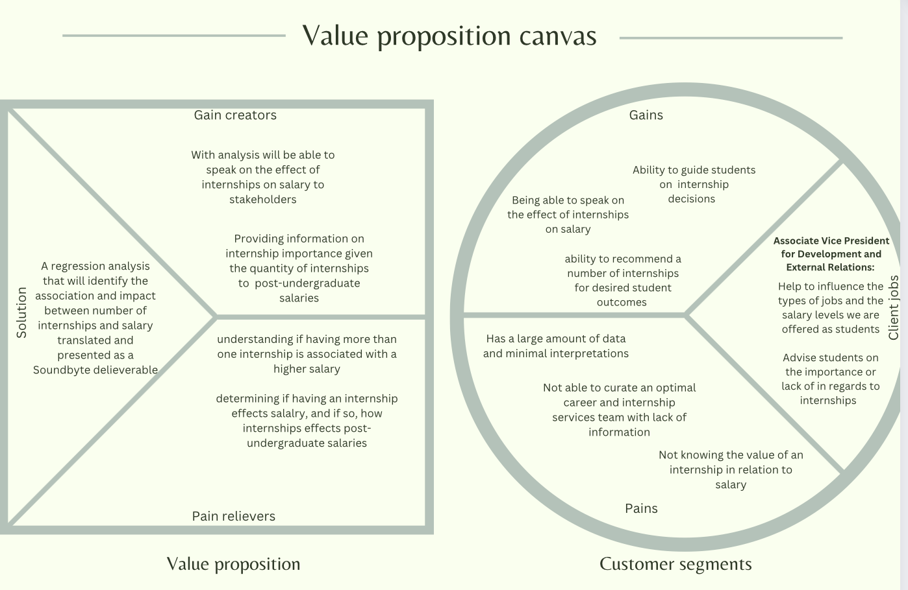

# Loading Necessary Packages and Environment

```{r}
knitr::opts_chunk$set(echo = TRUE,message=FALSE,warning=FALSE)

#package intialization
rm(list = ls()) # clear global environment
graphics.off() # close all graphics
if(require(pacman)==FALSE) install.packages("pacman")
pacman::p_load(DataExplorer,tidyverse,readxl,zoo,stargazer,kableExtra,skimr,plotly,ggpubr,vtable,tm)
```

```{r}
sessionInfo()
```


# Audience and Purpose

The purpose of this project is to take survey data and analyze it in
order to provide recommendations on the effects of number of internships
on salary. This will be done through the use of a regressive model to
see which variables have are the biggest predictors of salary.
Specifically, the effect of internships on salary. The identified
audience for this analysis is the Associate Vice President for
Development and External Relations.

## Business Value Proposition



# Data Sources

The data provided is a compilation of senior exit surveys from Miami
University, Oxford and a table of census regions by state from github.

## Read in the data

```{r}
data=readRDS(file = "FSB_BI_Survey_2019_2021.rds")
```

```{r}
geo = read_csv('https://raw.githubusercontent.com/cphalpert/census-regions/master/us%20census%20bureau%20regions%20and%20divisions.csv')
```

# Data Descriptions and Exploratory Data Analysis

```{r}
introduce(data) # Provides quick descriptions of the data
```

```{r}
plot_intro(data) # checking percent of missing observations for the whole data set 
```

20% of the data has missing observations, we must pay attention to
variables with a percentage of missing values higehr than 30% and
cosider imputing or dropping these variables.

```{r}
plot_missing(data) #creates a graph of the percent missing for each variable
```

We must consider which of the variables with a percentage of missing
observations above 50% are crucial to our analysis. To analyze the
effects of internship on salary we must first ensure our response
variable, survey_salary is ready for the analysis.

```{r}
plot_histogram(data$survey_salary) #shows the distribution of salary in order for us to see how to best impute the missing values
```

The data is slightly skewed to the right due to some extreme outliers.
In order to handle the missing observations we will impute the mean
salary for each major1 category.

```{r}
plot_bar(data$survey_plans) # shows the distribution of responses for the variable survey_plans in order to assess what we need to control for in salary
```

```{r}
plot_bar(data$survey_internships) #shows the distribution of responses for the variable survey_internships
```

Because survey_internships contains information on the number of
internships the individual participated in, there is no need for any of
the survey_intern variables that individually specify the number of
internships each individual has, therefor we will drop all 4 of these
variables.

```{r}
plot_bar(data$latin_honors) # checking the observations in this variable
```

Because Latin honors holds the information for those graduated with
Magna, Summa or just Cum Laude, we will drop the individual variables
Magna, Summa and Cum Laude and use the variable latin_honors along with
GPA.Range to control for academic achievements.

# Variables we want to use

As previously mentioned, our two response variables are survey_salary
and survey_plans due to the scope of our question. Additionally, we will
keep the following variables: year.x, to control for changes in time
GPA.Range and latin_honors to control for varying levels of academic
success `Combined Bacc and Masters`, major1 and major2 to control for
the differences in profession and quantity of majors/ masters Gender and
IPEDS.Race.Ethnicity to control for pay differences by race, ethnicity
or gender survey_state to control for location rather than survey_city,
this will be dropped

the remaining variables will be removed due to their irrelevance to our
analysis

## subsetting data

```{r}
data = data |> # minimizing the data to the variables we will keep in the analysis 
  dplyr::select(year.x, GPA.Range, major1, major2, survey_plans, survey_internships, survey_salary, Gender, IPEDS.Race.Ethnicity, latin_honors, `Combined Bacc and Masters`, survey_state)
```

## changing data types

```{r}
#making all the categorical variables in our analysis factors for the purpose of constructing a regressive model
data$year.x = as.factor(data$year.x)
data$GPA.Range = as.factor(data$GPA.Range)
data$survey_plans = as.factor(data$survey_plans)
data$Gender = as.factor(data$Gender)
data$IPEDS.Race.Ethnicity = as.factor(data$IPEDS.Race.Ethnicity)
data$`Combined Bacc and Masters` = 
  as.factor(data$`Combined Bacc and Masters`)

## if the variables aren't encoded here they will be encoded later in the analysis
```

# Data Preprocessing

To effectively predict salary based on number of internships using
regression. We will begin by cleaning up the survey_state variables so
that all the state names are consistent. we will then use the imported
data 'geo' which defines regions based on census data, to group the
states into regions and reduce the levels in our analysis. We will then
clean the variables major1 and major2 by ensuring all majors are
relevant and correctly spelled. Additionally entrepreneurship will be
switched from major 1 to 2. Finally, we will assess any missing
observations that may affect our data.

## Location Cleaning

```{r}
#the survey_state variables is of type character, need to convert to factor to check levels and model
data$survey_state = as.factor(data$survey_state)
#check the levels 
levels(data$survey_state)
```

this variable has too many levels and differences in entries for the
same intended location. The variable is supposed to only hold states as
responses, however there are locations listed outside of the united
states. On the assumption that our client does not know enough about
locations outside of the US and its effect on salary, we will classify
all observations that are not states as NA.

```{r}
#cleaning the observations 
# Convert state names to uppercase for consistency
data$survey_state <- tolower(data$survey_state)

#remove abbreviations
data$survey_state <- gsub("[^a-zA-Z]", "", data$survey_state)

#convert to numerical representations
data$survey_state <- match(data$survey_state, tolower(state.abb))

data$survey_state <- state.name[(data$survey_state)] 
print(unique(data$survey_state))
```

```{r}
data$State = data$survey_state # changing the name so it matches the geo data for a merge
```

Because of the high volume of NA values in the states, we don't want to
delete them from the data set. Therefore, we will simply encode this
data as missing.

```{r}
# making the unknown values a separate factor
data$State = fct_explicit_na(data$State, 'Unknown')
```

Merging the Region table (geo) and the states, while maintaining the
unknown values

```{r}
## Needed for the following steps to maintain the unknown values with the merge
data$State = as.character(data$State)
```

To maintain the null values we subset the data frame, so this data would
not be loss in the merge. We also made sure that the columns name and
quantity matched between the two data sets.

```{r}
# subsetting for Unknown
Loc_unknown = subset(data, State == 'Unknown')

# Dropping survey state
Loc_unknown = subset(Loc_unknown, select = -c(survey_state))

# Renaming the State Column
Loc_unknown = Loc_unknown %>%
  rename('Region' = 'State')
```

Merging the Data

```{r}
# preparing the data df for the merge
data = subset(data, State != 'Unknown')
```

```{r}
# merging geo table and data table by State
data = merge(data, geo, by = "State")
```

```{r}
data = data |> # minimizing the data to the variables we will keep in the analysis 
  subset(select = -c(survey_state, Division, `State Code`, State))
```

```{r}
## Combining the datasets
data = rbind(data, Loc_unknown)
```

## Major1 Cleaning

```{r}
unique(data$major1)
```

Management and Leadership and Human Capital Mgmt& Leadership are
referring to the same major. We will combine these observations under
the correct name Human Capital Mgmt& Leadership. Management and
Organizations is no longer a Major and only has one observation, this
will be dropped. \### Management and Leadership v. Human Capital Mgmt &
Leadership v. Management and Organizations

```{r}
library(dplyr)

# Apply the correction selectively
data = data %>%
  mutate(major1 = ifelse(major1 %in% c("Management and Leadership", "Management and Organizations", "Human Capital Mgmt& Leadership"), "Human Capital Mgmt & Leadership", as.character(major1)))

# Verify the results
unique(data$major1)

```

### What is Interdisciplinary Business Management ?

This variable only holds 13 observations and no salary data. This Will
skew our analysis and provides no relevant information. the observations
will be dropped

```{r}
data = data[data$major1 != "Interdisciplinary Bus Managemt", ]

# Verify the results
unique(data$major1)
```

### Entrepreneurship can only be a co-major or minor.

these observations should be moved to major 2 as for those who do not
have a major 2, entrepreneurship cannot be major 1.

```{r}
data$major1 <- as.character(data$major1)
data$major2 <- as.character(data$major2)
data[data$major1 == "Entrepreneurship", c("major1", "major2")] <- data[data$major1 == "Entrepreneurship", c("major2", "major1")]
```

```{r}
## making major1 a factor again, we further encode major2 later
data$major1 = as.factor(data$major1)
```

```{r}
# Verify the results
unique(data$major1)
```

### What's general business ?

This observation contains only one row and almost all of the data within
this row is NA, these observations will also be removed

```{r}
data = data[data$major1 != "General Business", ]
# Verify the results
unique(data$major1)
```

## imputing survey_salary

```{r}
  data=data |> 
  dplyr::group_by(major1) |># grouping by major to obtain mean salary per major
  mutate(survey_salary=replace(survey_salary,is.na(survey_salary), mean(survey_salary,na.rm=T))) #filling all NA observations with the mean salalry for that respective major. 

#verifying results
sum(is.na(data$survey_salary))
```

## Internship Condensing

In order to better interpret number of internships we will re-construct
the variable to better match the scope of the question. Our client is
interested in knowing whether 0, 1 or more than one internship leads to
a higher salary. We will group the observations within the variable
survey_internships so that for all internship counts greater than 1 it
shows "MoreThanOne"

```{r}
data$survey_internships <- fct_collapse(data$survey_internships,
  None = "0",
  One = "1",
  MoreThanOne = c("2", "3", "4", "5")
)
```

```{r}
data$survey_internships = as.factor(data$survey_internships) # transforming into a factor for the purpose of our regressive model
```

## Making Latin Honors Binary

Why we want to make this binary for better interpretation. If you have a
Latin honors, regardless of its level to simplify the levels within the
variable and its interpretation for our analysis. We want to be able to
generalize the conclusion and tell the client wether Latin honors in
general is significant enough to control for.

```{r}
data$latin_honors = ifelse(
  data$latin_honors != "0", 
  1, 
  0)
```

```{r}
data$latin_honors = as.factor(data$latin_honors) 
```

## Making Major2 Binary

Similar to Latin Honors, we want to control for if having a second major
affects salary. To do this and simplify our analysis, we want to make
this a Binary variable for the purpose of assessing salary differences
by quantity of majors not secondary category.

```{r}
data$major2 = ifelse(
  data$major2 != "none", 
  1, 
  0)
```

```{r}
data$major2 = as.factor(data$major2) # transforming into a factor for the purpose of our regressive model
```

## Drop remaining NAs

In order to ensure that the variables survey_internships and
survey_plans are clean and accurate for our analysis in predicting
salary we must drop the remaining NA values. these variables are not
easily amputated, so rather than risking the accuracy of our analysis,
we will drop these values from the variable.

```{r}
data = data |> na.omit()
data
```

# Conclusion

Now that our data is clean and ready for analysis, we will construct a
regressive model to predict salary.
